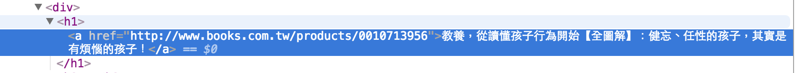
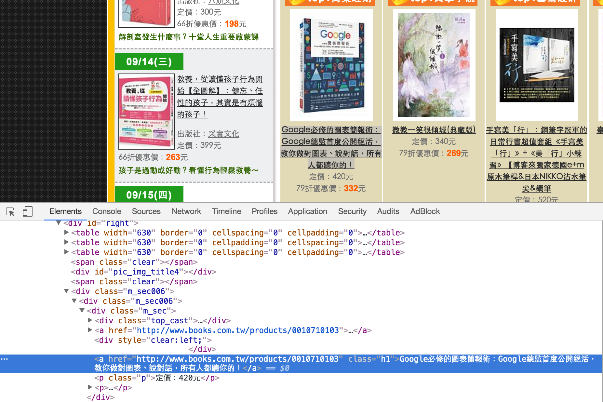
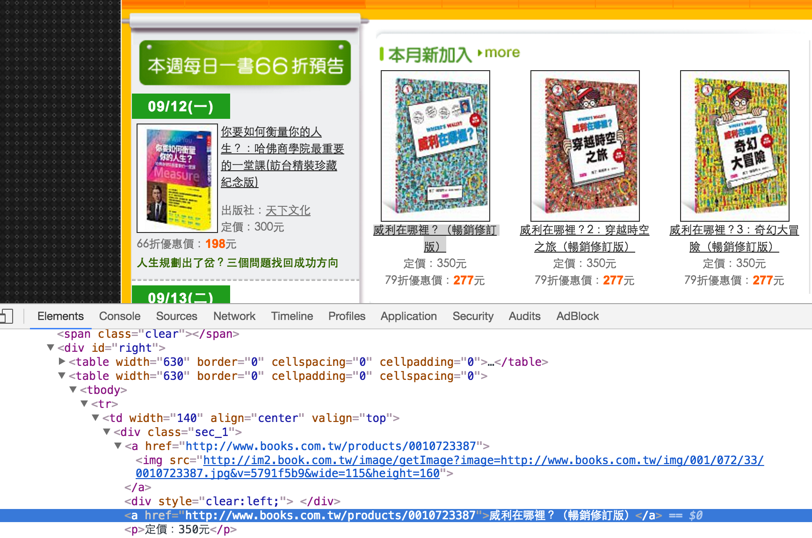

## 資源

臨摹：[爬蟲系列文 - Ruby爬蟲初探 « Carlos' notes](http://carlos-blog.logdown.com/posts/2016/06/10/reptile-series-approach)

路徑： `ezparser/examples/ex2`

## 範例2：爬博客來的每日六六折，印出該網址的書名

在這範例中，我們去爬[博客來的每日六六折](http://www.books.com.tw/activity/gold66_day/?loc=activity_BK_001)

create `ezparser/examples/ex2/carlo.rb`

完整code
```
require 'nokogiri'
require 'open-uri'

books = Nokogiri::HTML(open('http://www.books.com.tw/activity/gold66_day/?loc=activity_BK_001'))

puts "### Search for nodes by css with Bookstore"

books.css('div h1 a').each do |a|
  puts a.content
end
```


<br>
一開始一樣先require `nokogiri`、`open-uri`
```
require 'nokogiri'
require 'open-uri'
```

然後去讀每日六六折的網址
```
books = Nokogiri::HTML(open('http://www.books.com.tw/activity/gold66_day/?loc=activity_BK_001'))
```

> 這邊的`open()`是Ruby module `open-uri`內建的，請參照[open-uri: Ruby Standard Library Documentation](http://ruby-doc.org/stdlib-2.3.0/libdoc/open-uri/rdoc/index.html)的[OpenURI](http://ruby-doc.org/stdlib-2.3.0/libdoc/open-uri/rdoc/OpenURI.html)。

接著我們用Chrome瀏覽[博客來的每日六六折](http://www.books.com.tw/activity/gold66_day/?loc=activity_BK_001)，看到左手邊的**本週每日一書66折預告**，滑鼠游標移到隨便一本書，然後右鍵`檢查`


我們可以看到，該書名的HTML結構以是`div > h1 > a`，所以我們知道**博客來66折**這網址的書他的書名都是以這結構包住的，於是我們就可以印出所有的書名



我們透過`css`來查找`a` tag，找到後印出`a` tag的`content`

```
puts "### Search for nodes by css with Bookstore"

books.css('div h1 a').each do |a|
  puts a.content
end
```

> 這邊的`books.css`這寫法，你可以參照[Nokogiri Tutorials](http://www.nokogiri.org)的[Searching an HTML / XML Document](http://www.nokogiri.org/tutorials/searching_a_xml_html_document.html)這一篇的**Basic Searching**這節，想看更多例子可以參照[Parsing HTML with Nokogiri](http://ruby.bastardsbook.com/chapters/html-parsing/)的**Nokogiri and CSS selectors**這節。`content`請參考[Modifying an HTML / XML Document](http://www.nokogiri.org/tutorials/modifying_an_html_xml_document.html)的**Changing text contents**會比較易懂。

最後成功印出
```
ruby carlo.rb

### Search for nodes by css with Bookstore
我的十堂大體解剖課：那些與大體老師在一起的時光
你要如何衡量你的人生？：哈佛商學院最重要的一堂課(訪台精裝珍藏紀念版)
我的十堂大體解剖課：那些與大體老師在一起的時光
教養，從讀懂孩子行為開始【全圖解】：健忘、任性的孩子，其實是有煩惱的孩子！
中年的意義：一個生物學家的觀點
小紅嘴鳥的奇幻飛行
搶救烘焙失誤：破解烘焙環節，學會基礎工序做變化，新手不出錯的信心指南
超高效K書達人
```

### 為何挑每日66折來爬

至於為何挑每日66折來爬，單純只是因為他比較好爬。

如果我不爬左手邊的66折，而是爬右手邊的**當季暢銷新書79折**呢？我一樣要先用chrome工具檢查



現在我用**Google必修的圖表簡報術**這本書為例，可以看到他包了很多層`... > div.m_sec006 > div.m_sec006 > a`


### 舉一反三：我們來爬66折網頁的**本月新加入**吧

目標：



可以看到，用chrome工具查看後發現他的結構是`div.sec_1 > a`

##### 我們當然可以用ex1教的`xpath`來爬

fix `ezparser/examples/ex2/carlo.rb`

完整code
```
require 'nokogiri'
require 'open-uri'

books = Nokogiri::HTML(open('http://www.books.com.tw/activity/gold66_day/?loc=activity_BK_001'))

puts "### Search for nodes by css with Bookstore"

books.xpath("//div[@class='sec_1']/a").each do |a|
  puts a.content
end
```

##### 也可以用ex2教的`css`來爬

fix `ezparser/examples/ex2/carlo.rb`

```
require 'nokogiri'
require 'open-uri'

books = Nokogiri::HTML(open('http://www.books.com.tw/activity/gold66_day/?loc=activity_BK_001'))

puts "### Search for nodes by css with Bookstore"

books.css("//div[@class='sec_1'] a").each do |a|
  puts a.content
end
```

最終都會印出
```
ruby carlo.rb

### Search for nodes by css with Bookstore

威利在哪裡？（暢銷修訂版）

威利在哪裡？2：穿越時空之旅（暢銷修訂版）

威利在哪裡？3：奇幻大冒險（暢銷修訂版）
```

> 除了`css`與`xpath`之外，你也可以用`search`。請參考[Nokogiri wiki](https://github.com/sparklemotion/nokogiri/wiki)的**Quick start to parsing HTML**這節。不過我個人是不太喜歡`search`，因為網路上的範例太少了。此外這節的第一個範例教你爬google搜尋的不要做，因為根本爬不出東西出來。

##### 印出內容也可以用`text()`

這是寫到`ex5`才來補充的，過去我習慣用`content`來取內容，不過在`ex5`是使用`text()`，於是我改寫了`ex2`的code來試試

fix ``

完整的code
```
require 'nokogiri'
require 'open-uri'

books = Nokogiri::HTML(open('http://www.books.com.tw/activity/gold66_day/?loc=activity_BK_001'))

puts "### Search for nodes by css with Bookstore"

books.xpath("//div[@class='sec_1']/a").each do |a|
  puts a.text()
end
```

work，印出
```
### Search for nodes by css with Bookstore

威利在哪裡？（暢銷修訂版）

威利在哪裡？2：穿越時空之旅（暢銷修訂版）

威利在哪裡？3：奇幻大冒險（暢銷修訂版）
```
