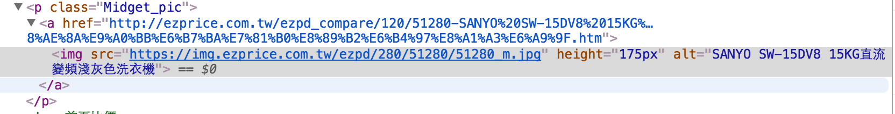

## 資源

臨摹：[用 Ruby 做網頁爬蟲](http://mgleon08.github.io/blog/2016/02/07/ruby-crawler/)

路徑： `ezparser/examples/ex4`

為了要跟前面的範例有連貫性，我爬的目標物與爬的寫法會跟範例的稍微不一樣，不過大同小異。

先上完整的code
```
require 'nokogiri'
require 'open-uri'

html = open("http://ezprice.com.tw/").read
doc = Nokogiri::HTML(html)
ans = []

doc.css('p[@class=Midget_pic] a img').each do |img|
  ans << img.attr('src')
end

temp_ans = ans.map do
  |url| url.match(/^http/) ? url : "http://ezprice.com.tw/#{url}"
end

temp_ans.each do |full_url|
  `wget #{full_url}`
end
```
<br>
### 確認要爬什麼

一樣我們先去[ezprice](http://ezprice.com.tw/)，挑選我們要爬的目標，我想要爬洗衣機那排的圖片


選好目標後用chrome工具查看



看來我們要找的是`class.Midget_pic > a > img`，從`img`的`alt`屬性可以得到該圖片的產品名稱，於是我們可以先確認一下爬的是否是我們要的。

然後我們組合過去所學的，在`ex1`中我們學會**找出「tag擁有特定 id or class」**，在`ex2`中我們學到**搜尋用`css`比用`xpath`更簡潔的寫法**，在`ex1`中我們學到**取出 Tag 的屬性**

create `examples/ex4/leon.rb`

完整的code
```
require 'nokogiri'
require 'open-uri'

html = open("http://ezprice.com.tw/").read
doc = Nokogiri::HTML(html)
ans = []

doc.css('p[@class=Midget_pic] a img').each do |img|
  puts img['alt']
end
```

然後跑跑看
```
ezparser/examples/ex4 on master*
$ ruby leon.rb
SANYO SW-15DV8 15KG直流變頻淺灰色洗衣機
ACER R7-372T-573Q (13.3吋FHD/i5-6200U/8G/256G SSD/Win10 觸控翻轉筆電)
Microtek 全友 FileScan DI 3125c
MITSUBISHI三菱 10.5L日本3D光眼清淨除濕機(MJ-E105EF)
ASUS華碩 Crosshair V Formula-Z 主機板
【Midea美的】3-5坪高效能定頻一對一分離式冷氣(MK-10SA+MG10DA)
SAKURA櫻花牌R3510B超薄型雙渦輪隱藏式90cm除油煙機
SAKURA櫻花牌26L數位恆溫強制排氣熱水器SH-2690
```

work，跑出的結果跟我想得一樣，我們要爬的東西位於`class.Midget_pic > a > img`。

臨摹[用 Ruby 做網頁爬蟲](http://mgleon08.github.io/blog/2016/02/07/ruby-crawler/)時發現，我們不只可以用`doc.['AttrName']`來取屬性，也可以用`doc.attr('AttrName')`來取屬性，所以上面的code也可以寫成

```
doc.css('p[@class=Midget_pic] a img').each do |img|
  puts img.attr('alt')
end
```

再來確定一下我們都抓到圖片了

fix `examples/ex4/leon.rb`

```
...
...
ans = []

doc.css('p[@class=Midget_pic] a img').each do |img|
  puts ans << img.attr('src')
end
```

結果：很好有抓到
```
ezparser/examples/ex4 on master*
$ ruby leon.rb

https://img.ezprice.com.tw/ezpd/664/45664/45664_m.jpg
https://img.ezprice.com.tw/ezpd/664/45664/45664_m.jpg
https://img.ezprice.com.tw/ezpd/168/49168/49168_m.jpg
https://img.ezprice.com.tw/ezpd/664/45664/45664_m.jpg
https://img.ezprice.com.tw/ezpd/168/49168/49168_m.jpg
https://img.ezprice.com.tw/ezpd/021/44021/44021_m.jpg
https://img.ezprice.com.tw/ezpd/664/45664/45664_m.jpg
https://img.ezprice.com.tw/ezpd/168/49168/49168_m.jpg
https://img.ezprice.com.tw/ezpd/021/44021/44021_m.jpg
https://img.ezprice.com.tw/ezpd/241/56241/56241_m.jpg
https://img.ezprice.com.tw/ezpd/664/45664/45664_m.jpg
https://img.ezprice.com.tw/ezpd/168/49168/49168_m.jpg
https://img.ezprice.com.tw/ezpd/021/44021/44021_m.jpg
https://img.ezprice.com.tw/ezpd/241/56241/56241_m.jpg
https://img.ezprice.com.tw/ezpd/968/22968/22968_m.jpg
https://img.ezprice.com.tw/ezpd/664/45664/45664_m.jpg
https://img.ezprice.com.tw/ezpd/168/49168/49168_m.jpg
https://img.ezprice.com.tw/ezpd/021/44021/44021_m.jpg
https://img.ezprice.com.tw/ezpd/241/56241/56241_m.jpg
https://img.ezprice.com.tw/ezpd/968/22968/22968_m.jpg
https://img.ezprice.com.tw/ezpd/060/37060/37060_m.jpg
https://img.ezprice.com.tw/ezpd/664/45664/45664_m.jpg
https://img.ezprice.com.tw/ezpd/168/49168/49168_m.jpg
https://img.ezprice.com.tw/ezpd/021/44021/44021_m.jpg
https://img.ezprice.com.tw/ezpd/241/56241/56241_m.jpg
https://img.ezprice.com.tw/ezpd/968/22968/22968_m.jpg
https://img.ezprice.com.tw/ezpd/060/37060/37060_m.jpg
https://img.ezprice.com.tw/ezpd/210/23210/23210_m.jpg
https://img.ezprice.com.tw/ezpd/664/45664/45664_m.jpg
https://img.ezprice.com.tw/ezpd/168/49168/49168_m.jpg
https://img.ezprice.com.tw/ezpd/021/44021/44021_m.jpg
https://img.ezprice.com.tw/ezpd/241/56241/56241_m.jpg
https://img.ezprice.com.tw/ezpd/968/22968/22968_m.jpg
https://img.ezprice.com.tw/ezpd/060/37060/37060_m.jpg
https://img.ezprice.com.tw/ezpd/210/23210/23210_m.jpg
https://img.ezprice.com.tw/ezpd/627/48627/48627_m.jpg
```

### 用Regex來濾圖片網址

不過我們可以看到裡面有很多重複的圖片，接下來我們用Regular Expression來濾網址

我們把`ans`的東西用Regex驗證有沒有**http**這段文字，有的話則存到`temp_ans`裡去

fix `examples/ex4/leon.rb`
```
doc = Nokogiri::HTML(html)
ans = []

doc.css('p[@class=Midget_pic] a img').each do |img|
  ans << img.attr('src')
end

temp_ans = ans.map do
  |url| url.match(/^http/) ? url : "http://ezprice.com.tw/#{url}"
end

temp_ans.each do |full_url|
  puts full_url
end
```

輸出結果
```
ezparser/examples/ex4 on master*
$ ruby leon.rb

https://img.ezprice.com.tw/ezpd/972/14972/14972_m.jpg
https://img.ezprice.com.tw/ezpd/384/8384/8384_m.jpg
https://img.ezprice.com.tw/ezpd/763/19763/19763_m.jpg
https://img.ezprice.com.tw/ezpd/361/22361/22361_m.jpg
https://img.ezprice.com.tw/ezpd/899/26899/26899_m.jpg
https://img.ezprice.com.tw/ezpd/372/25372/25372_m.jpg
https://img.ezprice.com.tw/ezpd/614/46614/46614_m.jpg
https://img.ezprice.com.tw/ezpd/018/44018/44018_m.jpg
```


###### map
> map是傳一個新array出來，但他本身不會改變，我們可以用Pry來玩玩[Enumerable#map](https://ruby-doc.org/core-2.1.4/Enumerable.html#method-i-map)的**Example**

```
$ pry

[1] pry(main)> a = [1, 2, 3, 4]
=> [1, 2, 3, 4]
[2] pry(main)> a.map { |i| i*i }
=> [1, 4, 9, 16]
[3] pry(main)> a
=> [1, 2, 3, 4]
```

###### Regular Expression
> 可以去[Rubular](http://rubular.com)玩玩抓網址，在第一格填入`^http`，第二格隨便你填一個網址，就能抓到他，若要練習Regex可以參考下面網站
> * [RegexOne](https://regexone.com/lesson/wildcards_dot?)

> * [Regex Crossword](https://regexcrossword.com/)

###### if else 簡寫
>`if else`簡寫很多語言都有，隨邊參考一個[if .. else .. 簡寫](http://imcloudwu.blogspot.tw/2013/12/c-if-else.html)就知道他是什麼了，不過範例的寫法不管怎麼跑都會跑到第一個結果，怎樣都不會跑去else的結果。

### 準備存圖片
如果你跟我一樣沒裝過`wget`就先來裝吧

```
brew install wget
```

fix `examples/ex4/leon.rb`
```
temp_ans.each do |full_url|
  `wget #{full_url}`
end
```

>一開始不知道`wget`是什麼，直到看到ihower的[Homebrew: 新一代 OSX 套件管理工具](https://ihower.tw/blog/archives/4308)這篇，才知道[Wget](http://www.gnu.org/software/wget/)是個GNU工具

如果你去看我專案下爬出來的圖片，會發現不是截圖的那個洗衣機，那是因為ezprice首頁的商品，每隔一段時間就換一批。

# 結束^_^
