# 資源

臨摹：[Steven教的最初範例：爬ezprice](https://hackpad.com/Railsfun-0907-fzkwOww6RXq#:h=ezprice)

路徑： `ezparser/examples/ex5`

<br>
# 範例5：爬比價網的大同電鍋搜尋

為了練這範例，東找西找找了前面四個範例臨摹，現在終於可以著手開始了。

若是沒安裝過RestClient，請先用irb安裝。
```
gem install rest-client
```


### 引用需要的檔案

create `examples/ex5/ezprice.rb`

```
require 'nokogiri'
require 'rest-client'
require 'pry'
require 'nokogiri'
require 'awesome_print'
```

### 寫好run程式碼的架構

fix `examples/ex5/ezprice.rb`

```
require 'nokogiri'
require 'rest-client'
require 'pry'
require 'nokogiri'
require 'awesome_print'

class SimpleGetCrawler
  def self.go!

  end
end

SimpleGetCrawler.go!

```
###### self
>對於**self**可以看[self | 邁向 Rails 高級新手](https://airsonwayne.gitbooks.io/rocodev-practice-series/content/chapter3-ruby/self.html)。一樣，我們直接操Pry這example code，就很清楚瞭解了。實際打過這範例後，再看[Self in Ruby | Jimmy Cuadra]()這篇，就很清楚了。

```
ezParser/examples/ex5 on master*
$ pry
[1] pry(main)> class Foo
[1] pry(main)*   def self.foo
[1] pry(main)*     "class method"
[1] pry(main)*   end
[1] pry(main)*   def foo
[1] pry(main)*     "instance method"
[1] pry(main)*   end
[1] pry(main)*   def foobar
[1] pry(main)*     self.foo
[1] pry(main)*   end
[1] pry(main)* end
=> :foobar
[2] pry(main)> Foo.foo
=> "class method"
[3] pry(main)> Foo.foobar
NoMethodError: undefined method `foobar' for Foo:Class
from (pry):13:in `__pry__'
[4] pry(main)> f = Foo.new
=> #<Foo:0x007f8ec2be8338>
[5] pry(main)> f.foobar
=> "instance method"
```

###### !
>印象中`!`在Ruby是永久改變某東西，辜狗看到[Why are exclamation marks used in Ruby methods?](http://stackoverflow.com/questions/612189/why-are-exclamation-marks-used-in-ruby-methods)這篇，跟我想得一樣

### 目標：爬出商品的「名稱、價錢」

我們的目標是爬出商品的「名稱、價錢」，一開始一樣要先研究我們要怎麼爬。這個範例我們去[EZprice比價網](http://ezprice.com.tw/)搜尋[大同電鍋](http://ezprice.com.tw/s/%E5%A4%A7%E5%90%8C%E9%9B%BB%E9%8D%8B/price/)，我們看到**符合 大同電鍋 比價結果的推薦商品**這邊，從上往下拉有一整排商品，我點選第一個**TATUNG大同電鍋10人份(TAC-10A)** 然後用chrome工具查看。

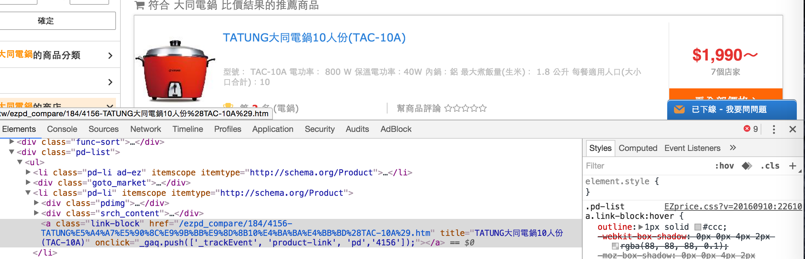

我們可以看到搜尋出來的商品，從上而下他的HTML結構是
```
div.pd-list > ul > li.pd-li.ad-ez + div.goto_market + li.pd-li + li.pd-li + li.pd-li + ...
```

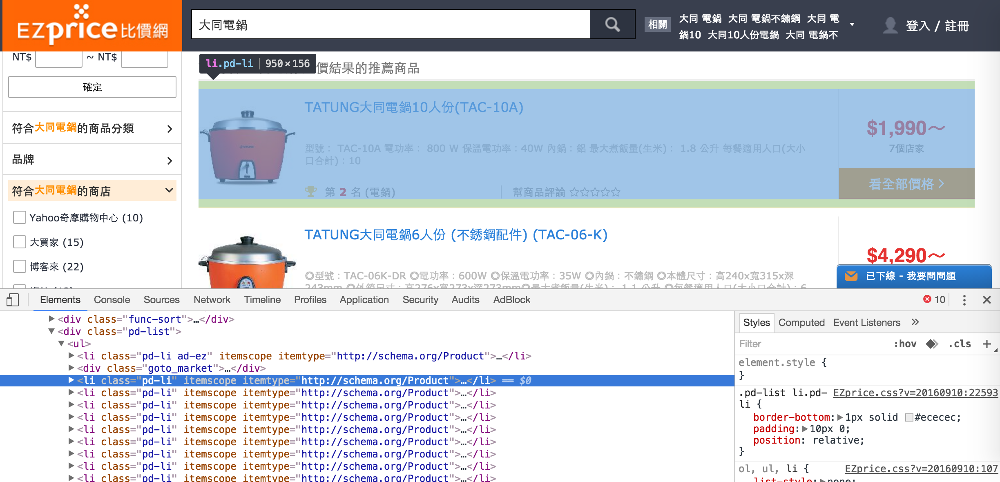

而我們點選的**TATUNG大同電鍋10人份(TAC-10A)** 它的結構是
```
li.pd-li > div.pdimg + div.srch_content + a.link-block
```

`div.srch_content`的子結構
```
div.srch_content > div.srch_c_l + div.srch_c_r
```

而各自裡面又有
```
div.srch_content > div.srch_c_l > div.srch_pdname > a[title="TATUNG大同電鍋10人份(TAC-10A)"]
```

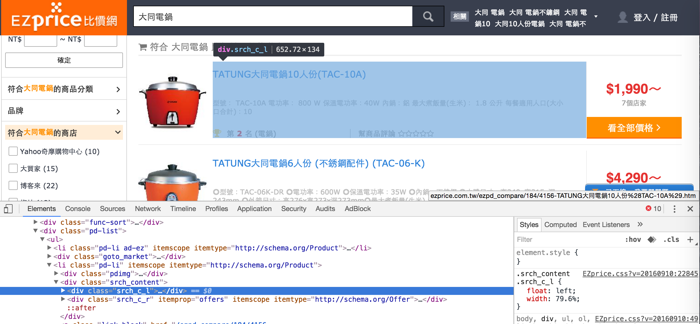

與
```
div.srch_content > div.srch_c_r > div.price_range + div.shop_count + link + a
```

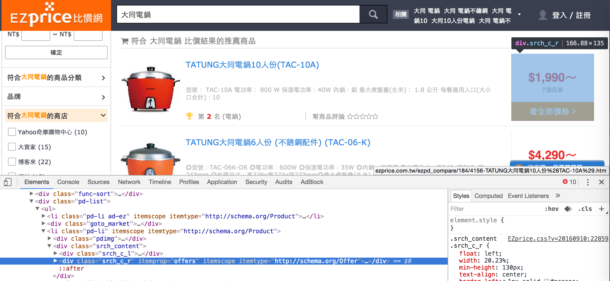

知道結構後我們就很愉快啦

我們先抓到一整排商品`div.pd-list > li`。


以第一項商品**TATUNG大同電鍋10人份(TAC-10A)** 為例

我們從`li.pd-li > div.srch_content > div.srch_c_l > div.srch_pdname > a > h3{TATUNG大同電鍋10人份(TAC-10A)}`取出商品名稱

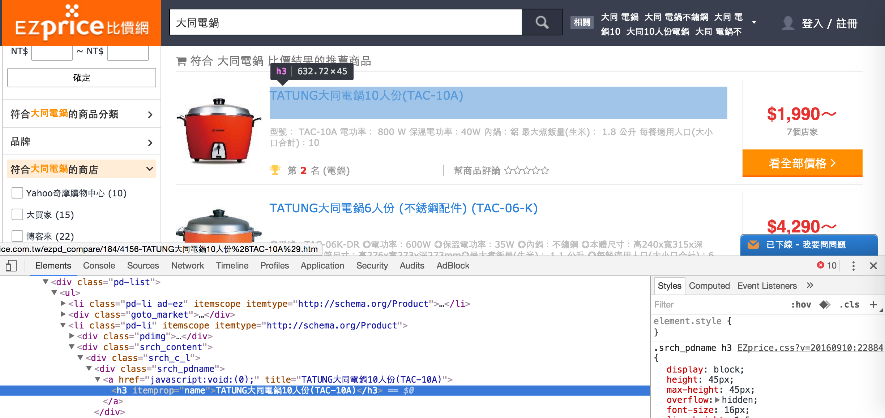

從`li.pd-li > div.srch_content > div.price_range > span[itemprop="price" content="1990"]`取出商品價格數字

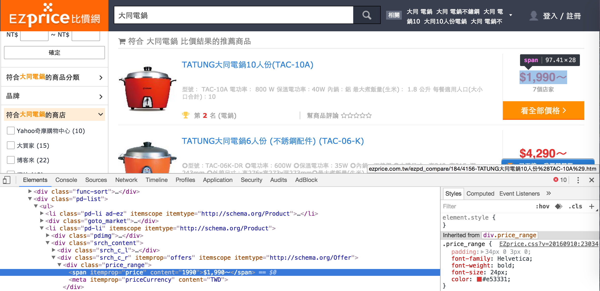

good!!!，可以開始寫code了

### 從網頁讀資料

fix `examples/ex5/ezprice.rb`

在這次的範例，我們用`rest-client`來讀網址，過去我們用`open-uri`把讀到的網址全部拿去給Nokogiri爬，但這次我們用`rest-client`可以把讀到的網址只取HTML結構中的`body`拿去給Nokogiri爬。

```
class SimpleGetCrawler
  def self.go!
    response = RestClient.get("http://ezprice.com.tw/s/%E5%A4%A7%E5%90%8C%E9%9B%BB%E9%8D%8B/price/")
    doc = Nokogiri::HTML(response.body)
  end
end
```

在此我們先來看一下剛剛裝的`awesome_print`的效果
```
class SimpleGetCrawler
  def self.go!
    response = RestClient.get("http://ezprice.com.tw/s/%E5%A4%A7%E5%90%8C%E9%9B%BB%E9%8D%8B/price/")
    doc = Nokogiri::HTML(response.body)

    ap doc
  end
end
```

然後去`iTerm`，在`zParser/examples/ex5`下
```
ruby ezprice.rb
```

可以看到，比用傳統的`print doc`畫面精美許多

###### RestClient
>比`open-uri`功能更強大的`rest-client`。

>一開始我是先看ihower的[Ruby HTTP clients](https://ihower.tw/blog/archives/2941)這篇文章，知道RestClient是透過 HTTP 抓取資料的工具。

>初學[rest-client的GitHub](https://github.com/rest-client/rest-client)看該專案的`README.md`就有像我這種新手需要的知識。我們先看[Usage: Raw URL](https://github.com/rest-client/rest-client#usage-raw-url)的**Basic usage**這節，知道RestClient的`post`與`get`就是HTML Verb的POST、GET，實例可以看[REST Client Example in Ruby](https://webdevsurya.wordpress.com/2014/03/18/rest-client-example-in-ruby/)這篇。

>再來看**More detailed examples:** 這節，就知道怎麼用了。不過只是看example code沒感覺，所以我們一樣操Pry吧。這次我拿ihower的[Ruby on Rails實戰聖經](https://ihower.tw/rails4/)來玩玩

```
ezParser/examples/ex5 on master*

$ pry
[1] pry(main)> require 'rest-client'
=> true
[2] pry(main)> RestClient.get 'https://ihower.tw/rails4/'
=> <RestClient::Response 200 "<!DOCTYPE h...">
[3] pry(main)> response = RestClient.get 'https://ihower.tw/rails4/'
=> <RestClient::Response 200 "<!DOCTYPE h...">
[4] pry(main)> response.code
=> 200
[5] pry(main)> response.cookies
=> {}
[6] pry(main)> response.headers
=> {:server=>"nginx",
 :date=>"Thu, 15 Sep 2016 06:31:06 GMT",
 :content_type=>"text/html",
 :last_modified=>"Thu, 07 Jul 2016 05:00:58 GMT",
 :transfer_encoding=>"chunked",
 :connection=>"keep-alive",
 :vary=>"Accept-Encoding",
 :etag=>"W/\"577de20a-2dc6\"",
 :strict_transport_security=>"max-age=31536000",
 :x_content_type_options=>"nosniff",
 :x_xss_protection=>"1; mode=block",
 :content_encoding=>"gzip"}
[7] pry(main)> response.body
=>..... (一大串，要退出請按q)
```

###### Awesome print
>可以先瀏覽[試用 awesome_print Gem](http://sikaplayground.blogspot.tw/2014/08/awesomeprint-gem.html)這篇，然後再去[awesome_print的GitHub](https://github.com/awesome-print/awesome_print)看[Examples](https://github.com/awesome-print/awesome_print#examples)直接操Pry

```
ezParser/examples/ex5 on master*
$ pry
[1] pry(main)> require "awesome_print"
=> true
[2] pry(main)> data = [ false, 42, %w(forty two), { :now => Time.now, :class => Time.now.class, :distance => 42e42 } ]
=> [false, 42, ["forty", "two"], {:now=>2016-09-16 21:04:14 +0800, :class=>Time, :distance=>4.2e+43}]
[3] pry(main)> ap data
[
    [0] false,
    [1] 42,
    [2] [
        [0] "forty",
        [1] "two"
    ],
    [3] {
             :now => 2016-09-16 21:04:14 +0800,
           :class => Time < Object,
        :distance => 4.2e+43
    }
]
=> nil
```
可以看到畫面整個變得非常精美，結構清楚。

### 寫好爬蟲的基本架構

fix `examples/ex5/ezprice.rb`

```
class SimpleGetCrawler
  def self.go!
    response = RestClient.get("http://ezprice.com.tw/s/%E5%A4%A7%E5%90%8C%E9%9B%BB%E9%8D%8B/price/")
    doc = Nokogiri::HTML(response.body)
    list = []
    doc.css(".pd-list li").each_with_index do |pd, index|
      hash = {}

      list << hash
    end
    ap list
  end
end
```

寫到這邊，有沒有感覺很像我們`ex3`的架構。

###### each_with_index
>[Enumerable#each_with_index](http://ruby-doc.org/core-2.3.1/Enumerable.html#method-i-each_with_index)，一樣看到**example code**。如果你跟我一樣第一次看時不是很懂，可以看[Arrays: map & eachwithindex](https://blog.hothero.org/2015/05/29/ruby-on-rails-cool-stuff-tip/)這篇，不過第一個範例的寫法是錯的。

錯的，哪有`{}`與`do`連用，應該是只有`{}`或只有`do...end`。

```
['a', 'b', 'c'].each_with_index do { |item, index|
  puts "#{index}-#{item}"
}
```

對的

```
['a', 'b', 'c'].each_with_index  { |item, index|
  puts "#{index}-#{item}"
}
```

或寫成

```
['a', 'b', 'c'].each_with_index do  |item, index|
  puts "#{index}-#{item}"
end
```

於是我們操Pry
```
ezParser/examples/ex5 on master*
$ pry

[1] pry(main)> ['a', 'b', 'c'].each_with_index  { |item, index|
[1] pry(main)*  puts "#{index}-#{item}"
[1] pry(main)* }
0-a
1-b
2-c
=> ["a", "b", "c"]

[2] pry(main)> {"Jane Doe" => 10, "Jim Doe" => 6}.each_with_index do |item, index|
[2] pry(main)*   puts "#{index}-#{item}"
[2] pry(main)* end
0-["Jane Doe", 10]
1-["Jim Doe", 6]
=> {"Jane Doe"=>10, "Jim Doe"=>6}
```

### 爬出商品名稱

先把觀察到的心得寫在這：剛開始學時用`xpath`，都以為要一層一層寫，現在用`css`爬，發現只要寫要爬的**屬性或HTML tag**，不需要一層層每層都寫，真是方便愉快啊。

fix `examples/ex5/ezprice.rb`

```
class SimpleGetCrawler
  def self.go!
    response = RestClient.get("http://ezprice.com.tw/s/%E5%A4%A7%E5%90%8C%E9%9B%BB%E9%8D%8B/price/")
    doc = Nokogiri::HTML(response.body)
    list = []
    doc.css(".pd-list li").each_with_index do |pd, index|
      hash = {}
      hash[:title] = pd.css(".srch_pdname").text().strip

      list << hash
    end
    ap list
  end
end
```

###### text
>用來取HTML tag裡的文字，跟Nokogiri的`content`一樣的用法，詳情幾見`ex2`的筆記`wiki/Note_ex2.md`。另外這個text真的很妙，在這範例中我們要爬的目標是`div.srch_pdname > a > h3{商品名稱}`，我們只要寫`pd.css(".srch_pdname").text().strip`就能抓到最裡面那層`h3`的文字，真的太神奇了XD

###### strip
>一個去掉**空格、換行字元**的方法，請看[String#strip](https://ruby-doc.org/core-2.2.0/String.html#method-i-strip)，一樣操Pry就很有感了。

印出
```
ezParser/examples/ex5 on master*
$ ruby ezprice.rb
[
    [ 0] {
        :title => "大同電鍋不銹鋼內鍋【20人份】(TAC-20A-SG)"
    },
    [ 1] {
        :title => "TATUNG大同電鍋10人份(TAC-10A)"
    },
    [ 2] {
        :title => "TATUNG大同電鍋6人份 (不銹鋼配件) (TAC-06-K)"
    },
    [ 3] {
        :title => "TATUNG大同220V電鍋11人份(TAC-11K-D)"
    },
    [ 4] {
        :title => "大同 TATUNG 11人份不銹鋼配件電鍋(TAC-11T-D)"
    },
    [ 5] {
        :title => "TATUNG大同11人份多功能花漾電鍋TAC-11B"
    },
    [ 6] {
        :title => "TATUNG大同3人份多功能電鍋 (TAC-03DW)"
    },
    [ 7] {
        :title => "大同 TATUNG 10人份電鍋(TAC-10L-A)"
    },
    [ 8] {
        :title => "TATUNG 大同 10人份黃金電鍋 (TAC-10L-NGD)"
    },
    [ 9] {
        :title => "TATUNG大同20人份電鍋 (TAC-20A)"
    },
    [10] {
        :title => "TATUNG大同15人份電鍋 (TAC-15A)"
    },
    [11] {
        :title => "TATUNG大同11人份時尚奈米電鍋(TAC-11A)"
    },
    [12] {
        :title => "TATUNG大同6人份電鍋 (不鏽鋼內鍋) (TAC-06-S)"
    },
    [13] {
        :title => "TATUNG大同3人份電鍋 (不銹鋼內鍋) (TAC-3S)"
    },
    [14] {
        :title => "大同 TATUNG 15人份不銹鋼內鍋電鍋(TAC-15L-S)"
    },
    [15] {
        :title => "TATUNG大同11人份全不鏽鋼電鍋(TAC-11KN)"
    },
    [16] {
        :title => "TATUNG大同15人份電鍋 (不銹鋼內鍋) (TAC-15A-S)"
    },
    [17] {
        :title => "【大同TATUNG】6人份微電腦智慧溫控AI電鍋 TAC-06EA"
    },
    [18] {
        :title => "TATUNG大同20人份電鍋 (不銹鋼內鍋) (TAC-20A-S)"
    },
    [19] {
        :title => "【TATUNG大同】6人份電鍋（TAC-06L-SG/TAC-06L-SR）"
    },
    [20] {
        :title => "TATUNG大同 蛋黃哥按一下電鍋(6人份) (TAC-06L-NGTA )"
    },
    [21] {
        :title => "大同 TATUNG 11人份全不鏽鋼電鍋(TAC-11T-NM)"
    },
    [22] {
        :title => "大同電鍋電源線AC-8(6人、10人、11人)"
    },
    [23] {
        :title => "懷舊台灣鑰匙圈-大同電鍋"
    },
    [24] {
        :title => "懷舊台灣鑰匙圈-大同電鍋"
    },
    [25] {
        :title => "大同電鍋11人份全不鏽鋼TAC-11T-NM"
    },
    [26] {
        :title => "【福滿門】懷舊台灣鑰匙圈-大同電鍋-任選"
    },
    [27] {
        :title => "大同電鍋10人份不鏽鋼內鍋TAC-10L-CR 紅"
    },
    [28] {
        :title => "【福滿門】懷舊台灣鑰匙圈-大同電鍋-任選"
    },
    [29] {
        :title => "大同電鍋10人份不鏽鋼內鍋TAC-10L-CU_紫"
    },
    [30] {
        :title => "大同電鍋10人份不鏽鋼內鍋TAC-10L-CG_綠"
    },
    [31] {
        :title => "大同電鍋不銹鋼內鍋【20人份】(TAC-20A-SG)"
    },
    [32] {
        :title => "日本Recolte POT DUO ESPRIT RPD,一台四用鍋煎 煮 蒸 炸取代大同電鍋東阪屋"
    },
    [33] {
        :title => "大同電鍋6人份不鏽鋼內鍋TAC-06L-SI_桃紅"
    },
    [34] {
        :title => "【美心 MASIONS】維多利亞 Victoria 皇家316不鏽鋼電鍋內鍋 台灣製造 大同電鍋(10人份 23CM 加高型)"
    },
    [35] {
        :title => "【美心 MASIONS】維多利亞 Victoria 皇家316不鏽鋼電鍋內鍋 台灣製造 大同電鍋(10人份 23CM 加高型)"
    },
    [36] {
        :title => "大同6人星球電鍋TAC-06HT"
    },
    [37] {
        :title => "【大同】 15人份電鍋 TAC-15AS"
    },
    [38] {
        :title => "【大同】 20人份電鍋 TAC-20AS"
    },
    [39] {
        :title => "大同多功能電鍋15人份 紅色"
    },
    [40] {
        :title => "大同10人份220V電鍋"
    },
    [41] {
        :title => ""
    },
    [42] {
        :title => ""
    },
    [43] {
        :title => ""
    },
    [44] {
        :title => ""
    },
    [45] {
        :title => ""
    },
    [46] {
        :title => ""
    },
    [47] {
        :title => ""
    },
    [48] {
        :title => ""
    }
]
```

非常好，我們爬出商品名稱了，不過有很多是空的，所以我們再改一下code，讓`hash[:title]`做判斷，如果是空值就不要

fix `examples/ex5/ezprice.rb`

```
class SimpleGetCrawler
  def self.go!
    response = RestClient.get("http://ezprice.com.tw/s/%E5%A4%A7%E5%90%8C%E9%9B%BB%E9%8D%8B/price/")
    doc = Nokogiri::HTML(response.body)
    list = []
    doc.css(".pd-list li").each_with_index do |pd, index|
      ...

      list << hash if hash[:title] != ""
    end
    ap list
  end
end
```

然後再印一次，可以看到我們就不會抓這些空值了。

### 爬出商品價格

fix `examples/ex5/ezprice.rb`

```
class SimpleGetCrawler
  def self.go!
    response = RestClient.get("http://ezprice.com.tw/s/%E5%A4%A7%E5%90%8C%E9%9B%BB%E9%8D%8B/price/")
    doc = Nokogiri::HTML(response.body)
    list = []
    doc.css(".pd-list li").each_with_index do |pd, index|
      hash = {}
      hash[:title] = pd.css(".srch_pdname").text().strip
      hash[:price] = pd.css(".price_range [itemprop='price']").first("content").to_i

      list << hash if hash[:title] != ""
    end
    ap list
  end
end
```

噴錯
```
/Users/nicholas/.rvm/gems/ruby-2.2.2/gems/nokogiri-1.6.8/lib/nokogiri/xml/node_set.rb:27:in `first': undefined method `times' for "content":String (NoMethodError)
	from ezprice.rb:15:in `block in go!'
	from /Users/nicholas/.rvm/gems/ruby-2.2.2/gems/nokogiri-1.6.8/lib/nokogiri/xml/node_set.rb:187:in `block in each'
	from /Users/nicholas/.rvm/gems/ruby-2.2.2/gems/nokogiri-1.6.8/lib/nokogiri/xml/node_set.rb:186:in `upto'
	from /Users/nicholas/.rvm/gems/ruby-2.2.2/gems/nokogiri-1.6.8/lib/nokogiri/xml/node_set.rb:186:in `each'
	from ezprice.rb:12:in `each_with_index'
	from ezprice.rb:12:in `go!'
	from ezprice.rb:23:in `<main>'
```

抓蟲，一開始改成跟範例一樣，有加if判斷式
```
hash[:price] = pd.css(".price_range [itemprop='price']").first("content").to_i if pd.css(".price_range [itemprop='price']").first
```

結果噴一樣的錯誤，檢查了老半天才發現，應該寫成`first["content"]`

改成
```
hash[:price] = pd.css(".price_range [itemprop='price']").first["content"].to_i if pd.css(".price_range [itemprop='price']").first
```

~~後來想想這滿合邏輯的，因為我們要取hash中的東西都是用中括號`[]`來取的~~。直接看[Nokogiri的官方教學](http://www.nokogiri.org/tutorials/searching_a_xml_html_document.html)的**Slop**這節，他的example code就能看到`first["..."]`這樣的用法了，操作的練習可以去`Note_ex1.md`查看。

於是我們把判斷式拿掉

fix `examples/ex5/ezprice.rb`
```
if pd.css(".price_range [itemprop='price']").first
```


居然又噴錯
```
ezprice.rb:15:in `block in go!': undefined method `[]' for nil:NilClass (NoMethodError)
	from /Users/nicholas/.rvm/gems/ruby-2.2.2/gems/nokogiri-1.6.8/lib/nokogiri/xml/node_set.rb:187:in `block in each'
	from /Users/nicholas/.rvm/gems/ruby-2.2.2/gems/nokogiri-1.6.8/lib/nokogiri/xml/node_set.rb:186:in `upto'
	from /Users/nicholas/.rvm/gems/ruby-2.2.2/gems/nokogiri-1.6.8/lib/nokogiri/xml/node_set.rb:186:in `each'
	from ezprice.rb:12:in `each_with_index'
	from ezprice.rb:12:in `go!'
	from ezprice.rb:23:in `<main>'
```

於是我們回到[搜尋大同電鍋](http://ezprice.com.tw/s/大同電鍋/price/)開chrome查看到底怎麼回事吧，從我們剛剛印出的資料，我們知道最後一個商品是**大同10人份220V電鍋**

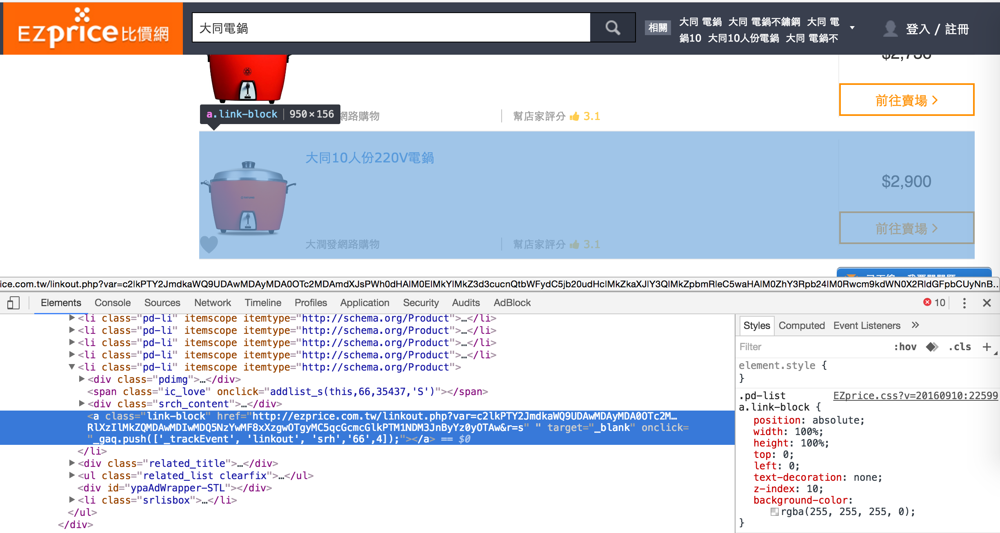

我們把這商品的`li`縮起來後發現，下面還有一個`li.srlistbox`，難怪剛剛爬商品名稱`hash[:title]`時會印出空值

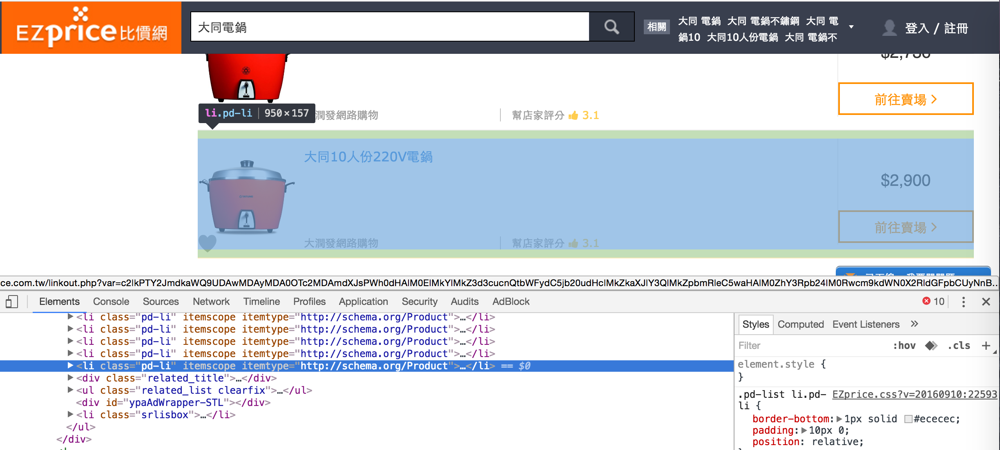

所以我們還是要像`hash[:title]`一樣寫個判斷式，判斷`.price_range`底下的`[itemprop='price']`是否存在

fix `examples/ex5/ezprice.rb`
```
 hash[:price] = pd.css(".price_range [itemprop='price']").first["content"].to_i if pd.css(".price_range [itemprop='price']").first
```

結果印出來的東西，下面又沒有價錢....

一樣繼續抓蟲，這次我們不只印價格，`span[itemprop='price']`的東西全部都印出來

fix `examples/ex5/ezprice.rb`
```
class SimpleGetCrawler
  def self.go!
    response = RestClient.get("http://ezprice.com.tw/s/%E5%A4%A7%E5%90%8C%E9%9B%BB%E9%8D%8B/price/")
    doc = Nokogiri::HTML(response.body)
    list = []
    doc.css(".pd-list li").each_with_index do |pd, index|
      hash = {}
      hash[:title] = pd.css(".srch_pdname").text().strip
      hash[:price] = pd.css(".price_range [itemprop='price']")

      list << hash if hash[:title] != ""
    end
    ap list
  end
end
```

印出
```
[
    [ 0] {
        :title => "大同電鍋不銹鋼內鍋【20人份】(TAC-20A-SG)",
        :price => []
    },
    [ 1] {
        :title => "TATUNG大同電鍋10人份(TAC-10A)",
        :price => <span itemprop="price" content="1990">$1,990～</span>
    },
    [ 2] {
        :title => "TATUNG大同電鍋6人份 (不銹鋼配件) (TAC-06-K)",
        :price => <span itemprop="price" content="4290">$4,290～</span>
    },
    [ 3] {
        :title => "TATUNG大同220V電鍋11人份(TAC-11K-D)",
        :price => <span itemprop="price" content="2580">$2,580～</span>
    },
    [ 4] {
        :title => "大同 TATUNG 11人份不銹鋼配件電鍋(TAC-11T-D)",
        :price => <span itemprop="price" content="2520">$2,520～</span>
    },
    [ 5] {
        :title => "TATUNG大同11人份多功能花漾電鍋TAC-11B",
        :price => <span itemprop="price" content="4024">$4,024～</span>
    },
    [ 6] {
        :title => "TATUNG大同3人份多功能電鍋 (TAC-03DW)",
        :price => <span itemprop="price" content="3196">$3,196～</span>
    },
    [ 7] {
        :title => "大同 TATUNG 10人份電鍋(TAC-10L-A)",
        :price => <span itemprop="price" content="2380">$2,380～</span>
    },
    [ 8] {
        :title => "TATUNG 大同 10人份黃金電鍋 (TAC-10L-NGD)",
        :price => <span itemprop="price" content="3880">$3,880～</span>
    },
    [ 9] {
        :title => "TATUNG大同20人份電鍋 (TAC-20A)",
        :price => <span itemprop="price" content="2933">$2,933～</span>
    },
    [10] {
        :title => "TATUNG大同15人份電鍋 (TAC-15A)",
        :price => <span itemprop="price" content="2650">$2,650～</span>
    },
    [11] {
        :title => "TATUNG大同11人份時尚奈米電鍋(TAC-11A)",
        :price => <span itemprop="price" content="4910">$4,910～</span>
    },
    [12] {
        :title => "TATUNG大同6人份電鍋 (不鏽鋼內鍋) (TAC-06-S)",
        :price => <span itemprop="price" content="1768">$1,768～</span>
    },
    [13] {
        :title => "TATUNG大同3人份電鍋 (不銹鋼內鍋) (TAC-3S)",
        :price => <span itemprop="price" content="1768">$1,768～</span>
    },
    [14] {
        :title => "大同 TATUNG 15人份不銹鋼內鍋電鍋(TAC-15L-S)",
        :price => <span itemprop="price" content="2397">$2,397～</span>
    },
    [15] {
        :title => "TATUNG大同11人份全不鏽鋼電鍋(TAC-11KN)",
        :price => <span itemprop="price" content="4280">$4,280～</span>
    },
    [16] {
        :title => "TATUNG大同15人份電鍋 (不銹鋼內鍋) (TAC-15A-S)",
        :price => <span itemprop="price" content="2650">$2,650～</span>
    },
    [17] {
        :title => "【大同TATUNG】6人份微電腦智慧溫控AI電鍋 TAC-06EA",
        :price => <span itemprop="price" content="5272">$5,272～</span>
    },
    [18] {
        :title => "TATUNG大同20人份電鍋 (不銹鋼內鍋) (TAC-20A-S)",
        :price => <span itemprop="price" content="3120">$3,120～</span>
    },
    [19] {
        :title => "【TATUNG大同】6人份電鍋（TAC-06L-SG/TAC-06L-SR）",
        :price => <span itemprop="price" content="1768">$1,768～</span>
    },
    [20] {
        :title => "TATUNG大同 蛋黃哥按一下電鍋(6人份) (TAC-06L-NGTA )",
        :price => <span itemprop="price" content="3278">$3,278～</span>
    },
    [21] {
        :title => "大同 TATUNG 11人份全不鏽鋼電鍋(TAC-11T-NM)",
        :price => <span itemprop="price" content="3699">$3,699～</span>
    },
    [22] {
        :title => "大同電鍋電源線AC-8(6人、10人、11人)",
        :price => []
    },
    [23] {
        :title => "懷舊台灣鑰匙圈-大同電鍋",
        :price => []
    },
    [24] {
        :title => "懷舊台灣鑰匙圈-大同電鍋",
        :price => []
    },
    [25] {
        :title => "大同電鍋11人份全不鏽鋼TAC-11T-NM",
        :price => []
    },
    [26] {
        :title => "【福滿門】懷舊台灣鑰匙圈-大同電鍋-任選",
        :price => []
    },
    [27] {
        :title => "大同電鍋10人份不鏽鋼內鍋TAC-10L-CR 紅",
        :price => []
    },
    [28] {
        :title => "【福滿門】懷舊台灣鑰匙圈-大同電鍋-任選",
        :price => []
    },
    [29] {
        :title => "大同電鍋10人份不鏽鋼內鍋TAC-10L-CU_紫",
        :price => []
    },
    [30] {
        :title => "大同電鍋10人份不鏽鋼內鍋TAC-10L-CG_綠",
        :price => []
    },
    [31] {
        :title => "大同電鍋不銹鋼內鍋【20人份】(TAC-20A-SG)",
        :price => []
    },
    [32] {
        :title => "日本Recolte POT DUO ESPRIT RPD,一台四用鍋煎 煮 蒸 炸取代大同電鍋東阪屋",
        :price => []
    },
    [33] {
        :title => "大同電鍋6人份不鏽鋼內鍋TAC-06L-SI_桃紅",
        :price => []
    },
    [34] {
        :title => "【美心 MASIONS】維多利亞 Victoria 皇家316不鏽鋼電鍋內鍋 台灣製造 大同電鍋(10人份 23CM 加高型)",
        :price => []
    },
    [35] {
        :title => "【美心 MASIONS】維多利亞 Victoria 皇家316不鏽鋼電鍋內鍋 台灣製造 大同電鍋(10人份 23CM 加高型)",
        :price => []
    },
    [36] {
        :title => "大同6人星球電鍋TAC-06HT",
        :price => []
    },
    [37] {
        :title => "【大同】 15人份電鍋 TAC-15AS",
        :price => []
    },
    [38] {
        :title => "【大同】 20人份電鍋 TAC-20AS",
        :price => []
    },
    [39] {
        :title => "大同多功能電鍋15人份 紅色",
        :price => []
    },
    [40] {
        :title => "大同10人份220V電鍋",
        :price => []
    }
]
```

恩....很好，而且連最上面EZ幫你選的**大同電鍋不銹鋼內鍋【20人份】** 也沒有，我們回到[搜尋大同電鍋](http://ezprice.com.tw/s/大同電鍋/price/)開chrome查看到底怎麼回事吧。我檢查最上面的**大同電鍋不銹鋼內鍋** 、**TATUNG大同電鍋10人份** 與最下面的**大同10人份220V電鍋** 這兩個商品

然後，一切真相大白了

**大同電鍋不銹鋼內鍋** 的價格位在`div.srch_c_r > div.market_range > span[itemprop='price']`

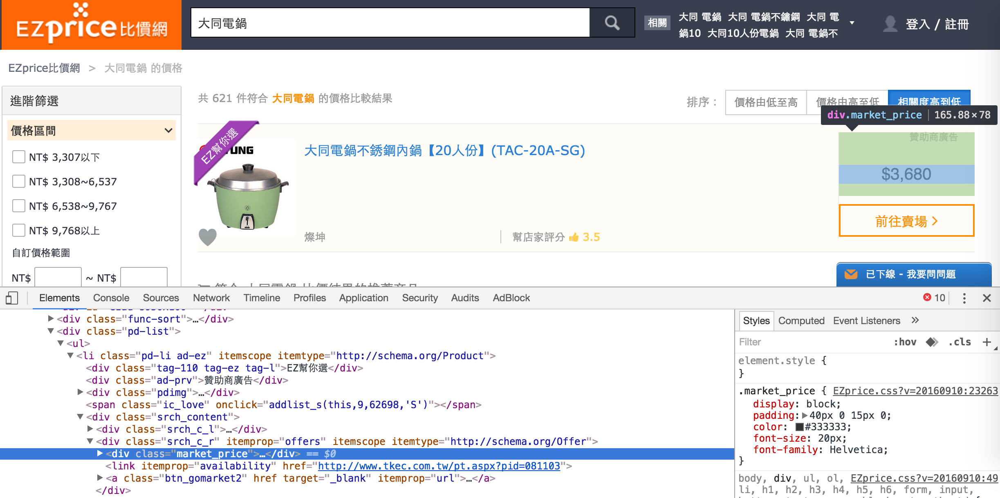

**TATUNG大同電鍋10人份** 的價格位在`div.srch_c_r > div.price_range > span[itemprop='price']`

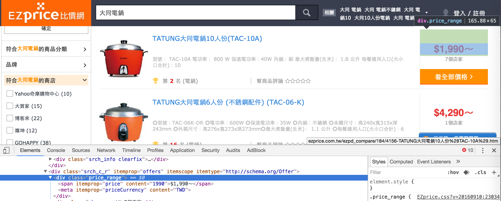

**大同10人份220V電鍋** 的價格位在`div.srch_c_r > div.market_range > span[itemprop='price']`

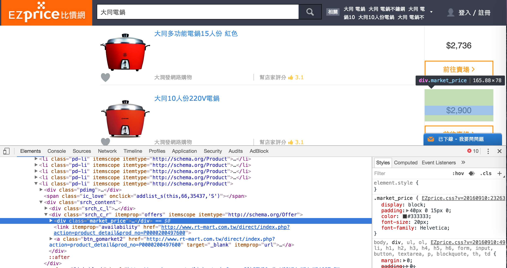

我們當初爬價格的**上層**標的物抓錯了，應該改成`.srch_c_r`

於是 fix `examples/ex5/ezprice.rb`
```
hash[:price] = pd.css(".srch_c_r [itemprop='price']")
```

很愉快，東西都抓到了，我們可以抓價格了

fix `examples/ex5/ezprice.rb`
```
class SimpleGetCrawler
  def self.go!
    response = RestClient.get("http://ezprice.com.tw/s/%E5%A4%A7%E5%90%8C%E9%9B%BB%E9%8D%8B/price/")
    doc = Nokogiri::HTML(response.body)
    list = []
    doc.css(".pd-list li").each_with_index do |pd, index|
      hash = {}
      hash[:title] = pd.css(".srch_pdname").text().strip
      hash[:price] = pd.css(".srch_c_r [itemprop='price']").first["content"]

      list << hash if hash[:title] != ""
    end
    ap list
  end
end
```

又噴，所以我們先把判斷`<span itemprop="price" content="...">....</span>`存在的`if pd.css(".price_range [itemprop='price']").first`判斷式加回去吧。若不懂為何這樣寫，可以參考[Searching an HTML / XML Document](http://www.nokogiri.org/tutorials/searching_a_xml_html_document.html)的**Single Results**這節

fix `examples/ex5/ezprice.rb`
```
class SimpleGetCrawler
  def self.go!
    response = RestClient.get("http://ezprice.com.tw/s/%E5%A4%A7%E5%90%8C%E9%9B%BB%E9%8D%8B/price/")
    doc = Nokogiri::HTML(response.body)
    list = []
    doc.css(".pd-list li").each_with_index do |pd, index|
      hash = {}
      hash[:title] = pd.css(".srch_pdname").text().strip
      hash[:price] = pd.css(".srch_c_r [itemprop='price']").first["content"] if pd.css(".price_range [itemprop='price']").first

      list << hash if hash[:title] != ""
    end
    ap list
  end
end
```

結果印出來的價格居然是string，所以我們用`to_i`把它轉成integer吧

fix `examples/ex5/ezprice.rb`

```
hash[:price] = pd.css(".srch_c_r [itemprop='price']").first["content"].to_i if pd.css(".price_range [itemprop='price']").first

```

很好，結束。

### 抓蟲趣，為何一定要寫if判斷式

一直以來噴錯的文字都是這段
```
ezprice.rb:15:in `block in go!': undefined method `[]' for nil:NilClass (NoMethodError)
	from /Users/nicholas/.rvm/gems/ruby-2.2.2/gems/nokogiri-1.6.8/lib/nokogiri/xml/node_set.rb:187:in `block in each'
	from /Users/nicholas/.rvm/gems/ruby-2.2.2/gems/nokogiri-1.6.8/lib/nokogiri/xml/node_set.rb:186:in `upto'
	from /Users/nicholas/.rvm/gems/ruby-2.2.2/gems/nokogiri-1.6.8/lib/nokogiri/xml/node_set.rb:186:in `each'
	from ezprice.rb:12:in `each_with_index'
	from ezprice.rb:12:in `go!'
	from ezprice.rb:23:in `<main>'
```

我們來用Pry來測試，不寫判斷式是否抓得到價格

###### 用Pry來抓蟲

  >參考[關於Ruby on Rails的Debug(除錯方式)](http://james1239090-blog.logdown.com/?page=3)這篇，用Pry抓蟲就設中斷點`binding.pry`在迴圈裡一層一層檢查，如果想要一次跳出，由於原始網頁已經遺失， 參考**如何跳出一个循环的Ruby Pry？** 這篇的[頁庫存檔](http://webcache.googleusercontent.com/search?q=cache:dR3BqmZQgHsJ:qa.helplib.com/361725+&cd=1&hl=zh-TW&ct=clnk&gl=tw)，可以直接在iTerm裡下`exit!`一次全部跳出迴圈。

fix `examples/ex5/ezprice.rb`

完整的code
```
require 'nokogiri'
require 'rest-client'
require 'pry'
require 'nokogiri'
require 'awesome_print'

class SimpleGetCrawler
  def self.go!
    response = RestClient.get("http://ezprice.com.tw/s/%E5%A4%A7%E5%90%8C%E9%9B%BB%E9%8D%8B/price/")
    doc = Nokogiri::HTML(response.body)
    list = []
    doc.css(".pd-list li").each_with_index do |pd, index|
      hash = {}
      hash[:title] = pd.css(".srch_pdname").text().strip
      # hash[:price] = pd.css(".srch_c_r [itemprop='price']").first["content"].to_i if pd.css(".srch_c_r [itemprop='price']").first

    puts  hash[:price] = pd.css(".srch_c_r [itemprop='price']").first["content"].to_i


      list << hash if hash[:title] != ""

      binding.pry
    end
    # ap list

  end
end

SimpleGetCrawler.go!
```

印出
```
ezParser/examples/ex5 on master*
$ ruby ezprice.rb
3680

From: /Users/nicholas/Desktop/pracCrawler/ezParser/examples/ex5/ezprice.rb @ line 22 SimpleGetCrawler.go!:

     8: def self.go!
     9:   response = RestClient.get("http://ezprice.com.tw/s/%E5%A4%A7%E5%90%8C%E9%9B%BB%E9%8D%8B/price/")
    10:   doc = Nokogiri::HTML(response.body)
    11:   list = []
    12:   doc.css(".pd-list li").each_with_index do |pd, index|
    13:     hash = {}
    14:     hash[:title] = pd.css(".srch_pdname").text().strip
    15:     # hash[:price] = pd.css(".srch_c_r [itemprop='price']").first["content"].to_i if pd.css(".srch_c_r [itemprop='price']").first
    16:
    17:   puts  hash[:price] = pd.css(".srch_c_r [itemprop='price']").first["content"].to_i
    18:
    19:
    20:     list << hash if hash[:title] != ""
    21:
 => 22:     binding.pry
    23:   end
    24:   # ap list
    25:
    26: end

[1] pry(SimpleGetCrawler)> exit
1990

From: /Users/nicholas/Desktop/pracCrawler/ezParser/examples/ex5/ezprice.rb @ line 22 SimpleGetCrawler.go!:

     8: def self.go!
     9:   response = RestClient.get("http://ezprice.com.tw/s/%E5%A4%A7%E5%90%8C%E9%9B%BB%E9%8D%8B/price/")
    10:   doc = Nokogiri::HTML(response.body)
    11:   list = []
    12:   doc.css(".pd-list li").each_with_index do |pd, index|
    13:     hash = {}
    14:     hash[:title] = pd.css(".srch_pdname").text().strip
    15:     # hash[:price] = pd.css(".srch_c_r [itemprop='price']").first["content"].to_i if pd.css(".srch_c_r [itemprop='price']").first
    16:
    17:   puts  hash[:price] = pd.css(".srch_c_r [itemprop='price']").first["content"].to_i
    18:
    19:
    20:     list << hash if hash[:title] != ""
    21:
 => 22:     binding.pry
    23:   end
    24:   # ap list
    25:
    26: end

[1] pry(SimpleGetCrawler)> exit!
```

恩....有抓到啊，再看一次原本的噴錯訊息，似乎跟`each_with_index`有關
```
ezprice.rb:15:in `block in go!': undefined method `[]' for nil:NilClass (NoMethodError)
	from /Users/nicholas/.rvm/gems/ruby-2.2.2/gems/nokogiri-1.6.8/lib/nokogiri/xml/node_set.rb:187:in `block in each'
	from /Users/nicholas/.rvm/gems/ruby-2.2.2/gems/nokogiri-1.6.8/lib/nokogiri/xml/node_set.rb:186:in `upto'
	from /Users/nicholas/.rvm/gems/ruby-2.2.2/gems/nokogiri-1.6.8/lib/nokogiri/xml/node_set.rb:186:in `each'
	from ezprice.rb:12:in `each_with_index'
	from ezprice.rb:12:in `go!'
	from ezprice.rb:23:in `<main>'
```

於是我們再簡化code

fix `examples/ex5/ezprice.rb`

```
require 'nokogiri'
require 'rest-client'
require 'pry'
require 'nokogiri'
require 'awesome_print'

class SimpleGetCrawler
  def self.go!
    response = RestClient.get("http://ezprice.com.tw/s/%E5%A4%A7%E5%90%8C%E9%9B%BB%E9%8D%8B/price/")
    doc = Nokogiri::HTML(response.body)
    list = []
    doc.css(".pd-list li").each_with_index do |pd, index|
      hash = {}
      hash[:title] = pd.css(".srch_pdname").text().strip

      puts  hash[:price] = pd.css(".srch_c_r [itemprop='price']").first["content"].to_i


      list << hash if hash[:title] != ""
    end


  end
end

SimpleGetCrawler.go!
```

印出
```
ezParser/examples/ex5 on master*
$ ruby ezprice.rb
3680
1990
4290
4024
3196
2380
2580
2508
3880
2933
2518
2397
1768
4910
1768
4280
2518
5272
2964
1768
3278
3601
150
120
120
3790
120
1890
1890
1890
120
3680
2270
2190
1590
1590
4490
2650
2900
2035
2964
ezprice.rb:17:in `block in go!': undefined method `[]' for nil:NilClass (NoMethodError)
	from /Users/nicholas/.rvm/gems/ruby-2.2.2/gems/nokogiri-1.6.8/lib/nokogiri/xml/node_set.rb:187:in `block in each'
	from /Users/nicholas/.rvm/gems/ruby-2.2.2/gems/nokogiri-1.6.8/lib/nokogiri/xml/node_set.rb:186:in `upto'
	from /Users/nicholas/.rvm/gems/ruby-2.2.2/gems/nokogiri-1.6.8/lib/nokogiri/xml/node_set.rb:186:in `each'
	from ezprice.rb:12:in `each_with_index'
	from ezprice.rb:12:in `go!'
	from ezprice.rb:30:in `<main>'
```

恩...果然是跳出`each_with_index`之後才噴的，現在來測試一下到底是`block in go!`的問題還是`each_with_index`的問題

fix `examples/ex5/ezprice.rb`

```
require 'nokogiri'
require 'rest-client'
require 'pry'
require 'nokogiri'
require 'awesome_print'

response = RestClient.get("http://ezprice.com.tw/s/%E5%A4%A7%E5%90%8C%E9%9B%BB%E9%8D%8B/price/")
doc = Nokogiri::HTML(response.body)
list = []
doc.css(".pd-list li").each_with_index do |pd, index|
  hash = {}
  hash[:title] = pd.css(".srch_pdname").text().strip


 puts  hash[:price] = pd.css(".srch_c_r [itemprop='price']").first["content"].to_i


  list << hash if hash[:title] != ""

# binding.pry
end

ap list
```

噴一樣的錯誤，果然問題在`each_with_index`裡面

### 請Steven大大救援

感謝Steven再教了我一次`binding.pry`的用法，雖然當初9/17的meetup時已經有演練過給全部人看了....(覺得自己太弱，當時完全跟不上 QQ)

原本我們寫的code
```
require 'nokogiri'
require 'rest-client'
require 'pry'
require 'nokogiri'
require 'awesome_print'

class SimpleGetCrawler
  def self.go!
    response = RestClient.get("http://ezprice.com.tw/s/%E5%A4%A7%E5%90%8C%E9%9B%BB%E9%8D%8B/price/")
    doc = Nokogiri::HTML(response.body)
    list = []
    doc.css(".pd-list li").each_with_index do |pd, index|
      hash = {}
      hash[:title] = pd.css(".srch_pdname").text().strip
      hash[:price] = pd.css(".srch_c_r [itemprop='price']").first["content"].to_i

      list << hash if hash[:title] != ""
    end
    ap list
  end
end

SimpleGetCrawler.go!
```

印出
```
ruby ezprice.rb
ezprice.rb:15:in `block in go!': undefined method `[]' for nil:NilClass (NoMethodError)
	from /Users/nicholas/.rvm/gems/ruby-2.2.2/gems/nokogiri-1.6.8/lib/nokogiri/xml/node_set.rb:187:in `block in each'
	from /Users/nicholas/.rvm/gems/ruby-2.2.2/gems/nokogiri-1.6.8/lib/nokogiri/xml/node_set.rb:186:in `upto'
	from /Users/nicholas/.rvm/gems/ruby-2.2.2/gems/nokogiri-1.6.8/lib/nokogiri/xml/node_set.rb:186:in `each'
	from ezprice.rb:12:in `each_with_index'
	from ezprice.rb:12:in `go!'
	from ezprice.rb:26:in `<main>'
```

發現有錯，於是我們用`binding.pry`來協助抓蟲

fix `examples/ex5/ezprice.rb`

```
require 'nokogiri'
require 'rest-client'
require 'pry'
require 'nokogiri'
require 'awesome_print'

class SimpleGetCrawler
  def self.go!
    response = RestClient.get("http://ezprice.com.tw/s/%E5%A4%A7%E5%90%8C%E9%9B%BB%E9%8D%8B/price/")
    doc = Nokogiri::HTML(response.body)
    list = []
    doc.css(".pd-list li").each_with_index do |pd, index|
      hash = {}
      hash[:title] = pd.css(".srch_pdname").text().strip

      binding.pry if pd.css(".srch_c_r [itemprop='price']").first == nil
      hash[:price] = pd.css(".srch_c_r [itemprop='price']").first["content"].to_i

      list << hash if hash[:title] != ""
    end

    ap list

  end

end

SimpleGetCrawler.go!
```

稍微解釋一下新加入的這段
```
binding.pry if pd.css(".srch_c_r [itemprop='price']").first == nil
hash[:price] = pd.css(".srch_c_r [itemprop='price']").first["content"].to_i
```

由於`console`一直跟我說抓價格的`hash[:price]`那行有誤，但是剛剛有看到，我們爬`pd.css(".srch_c_r [itemprop='price']")`都有抓到東西，所以我在抓價格的前一行，加入一個中斷點的判斷式
```
binding.pry if pd.css(".srch_c_r [itemprop='price']").first == nil
```

如果沒有抓到東西，就用`binding.pry`進入中斷點，於是印出
```
ezParser/examples/ex5 on master*
$ ruby ezprice.rb

From: /Users/nicholas/Desktop/pracCrawler/ezParser/examples/ex5/ezprice.rb @ line 16 SimpleGetCrawler.go!:

     8: def self.go!
     9:   response = RestClient.get("http://ezprice.com.tw/s/%E5%A4%A7%E5%90%8C%E9%9B%BB%E9%8D%8B/price/")
    10:   doc = Nokogiri::HTML(response.body)
    11:   list = []
    12:   doc.css(".pd-list li").each_with_index do |pd, index|
    13:     hash = {}
    14:     hash[:title] = pd.css(".srch_pdname").text().strip
    15:
 => 16:     binding.pry if pd.css(".srch_c_r [itemprop='price']").first == nil
    17:     hash[:price] = pd.css(".srch_c_r [itemprop='price']").first["content"].to_i
    18:
    19:     list << hash if hash[:title] != ""
    20:   end
    21:
    22:   ap list
    23:
    24: end

[1] pry(SimpleGetCrawler)>
```

###### binding.pry的用法
對於`binding.pry`的用法，可以參考葉早彬的[Rails開發常用gem分享](https://youtu.be/xPHoC2ASYhU?t=126)，看完後就會對下面的操作有感。現在我們來看看到底抓到什麼了
```
[1] pry(SimpleGetCrawler)> pd.css(".srch_c_r [itemprop='price']").first
=> nil
```

恩....我們真的抓到空值，那就給抓價格`hash[:price]`一個判斷式跳過`nil`吧


```
require 'nokogiri'
require 'rest-client'
require 'pry'
require 'nokogiri'
require 'awesome_print'

class SimpleGetCrawler
  def self.go!
    response = RestClient.get("http://ezprice.com.tw/s/%E5%A4%A7%E5%90%8C%E9%9B%BB%E9%8D%8B/price/")
    doc = Nokogiri::HTML(response.body)
    list = []
    doc.css(".pd-list li").each_with_index do |pd, index|
      hash = {}
      hash[:title] = pd.css(".srch_pdname").text().strip

      # binding.pry if pd.css(".srch_c_r [itemprop='price']").first == nil
      hash[:price] = pd.css(".srch_c_r [itemprop='price']").first["content"].to_i if pd.css(".srch_c_r [itemprop='price']").first != nil

      list << hash if hash[:title] != ""
    end

    ap list

  end

end

SimpleGetCrawler.go!

```

# work，成功印出所有價格了！！！ 這次終於結束了
