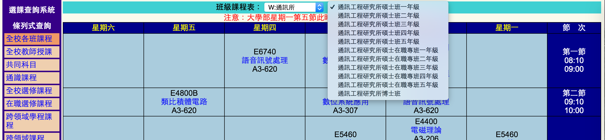
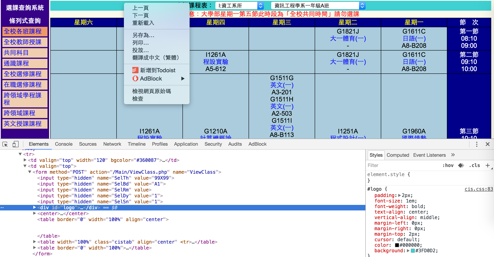
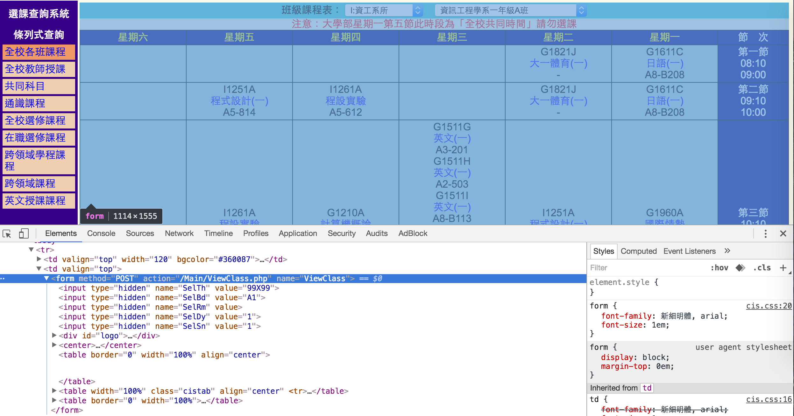
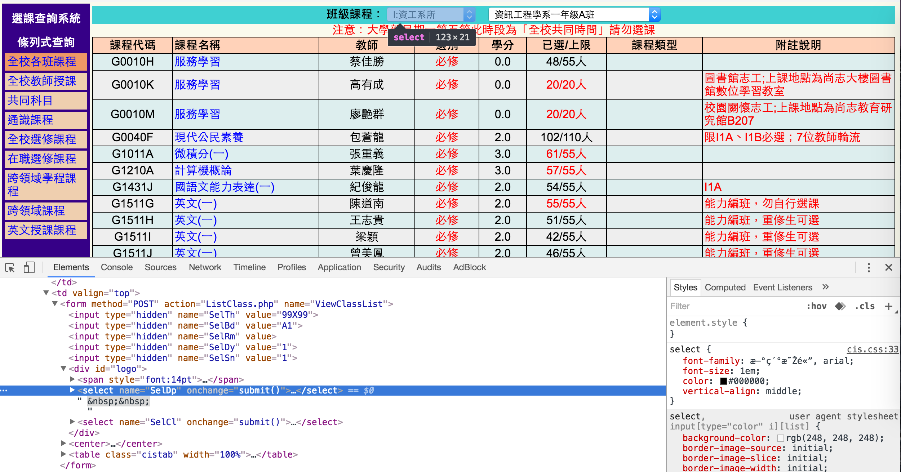
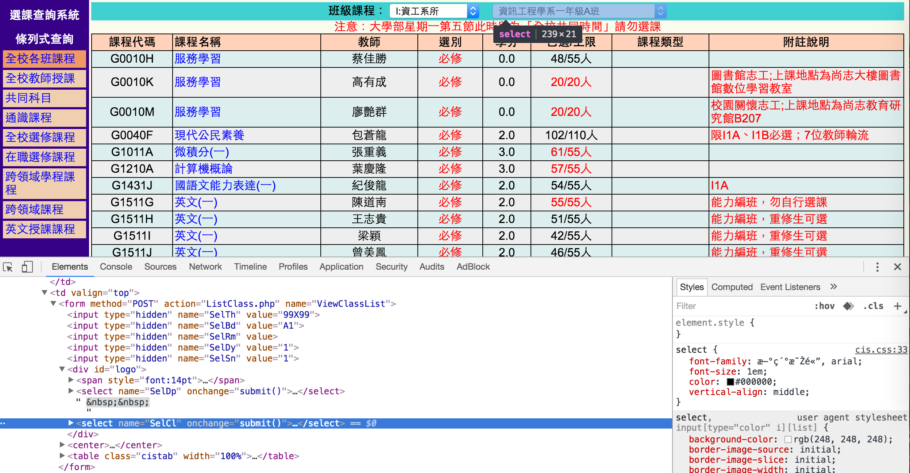
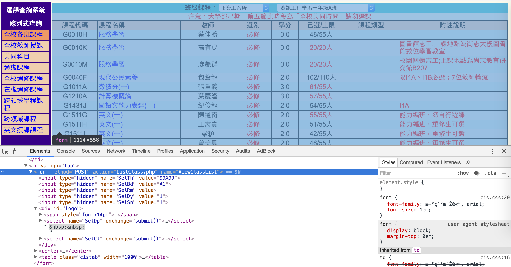

# 資源

臨摹：[Steven教的第二個範例：爬大同大學的課表](https://hackpad.com/Railsfun-0907-fzkwOww6RXq#:h=ezprice)

路徑： `ezparser/examples/ex6`

<br>
# 範例6：爬大同大學的課表

直接寫好爬蟲基本架構。

create `examples/ex6/ttucrawler.rb`

```
require 'pry'
require 'nokogiri'
require 'rest-client'
require 'awesome_print'

class TTuCrawler
  def self.go!
    response =
    doc = Nokogiri::HTML(response)
    list = []


    ap list
  end

end

TTuCrawler.go!
```

一開始我們發現，點選不同的**班級課程表**就會直接跳到該頁



我們要準備來爬大同的課表，一樣先用chrome工具檢查



發現它居然是個表單`form`







這個表單存在於`<td valign="top"></td>`裡面



這篇範例他用的班級課程表：**事經系所** 、**事業經營學系二年級B班**

它的結構如下
```
<td valign="top">
  <form action="" method="POST" name="Main/ViewClass.php">
    <input type="hidden" name="SelTh" value="99x99">
    <input type="hidden" name="SelBd" value="A1">
    <input type="hidden" name="SelRm" value>
    <input type="hidden" name="SelDy" value="1">
    <input type="hidden" name="SelSn" value="1">
    <div id="logo">
      <b>班級課表</b>
      <select name="SelDp" onchange="submit()"></select>
        <option value="UB1A">事業經營學系一年級A班</option>
        <option value="UB1B">事業經營學系一年級B班</option>
        <option value="UB2A">事業經營學系二年級A班</option>
        <option value="UB2B">事業經營學系二年級B班</option>
        ...
        ...
        <option value="EB5.">事業經營研究所碩士在職專班五年級</option>
    </div>
  </form>
</td>
```

[Usage: Raw URL](https://github.com/rest-client/rest-client#usage-raw-url)的**Basic usage**這節


###### mailto語法
>由於當初太菜完全跟不上，加上時間久遠，我看不懂`self.get_course_by_class`這個class在寫什麼，一開始我是用chrome工具找關鍵字`SelTh`、`99X99`...然後找到下面這串

```
<a
 href="ListClass.php?SelDp=05&amp;SelCl=UX1.&amp;SelTh=99X99&amp;SelBd=A1&amp;SelRm=&amp;SelDy=1&amp;SelSn=1">
 全校各班課程
</a>
```

>你可能會跟我一樣有疑問，這串`href`是在寫什麼。請參考[Getting to Know HTML - Learn to Code HTML & CSS](http://learn.shayhowe.com/html-css/getting-to-know-html/)的**Linking to an Email Address** 這節

>由於這[文章](http://learn.shayhowe.com/html-css/getting-to-know-html/)的字有點多，所以我直接在這邊解釋。該篇是用**寄信**為例，先上這篇的example code

```
<a href="mailto:shay@awesome.com?subject=Reaching%20Out&body=How%20are%20you">Email Me</a>
```

>他其實很好懂，寫mail會有標題`subject`與信的內容`body`。用`?`來定義標題，用`=`來表示該區塊的文字內容，用`%20`表示空格

```
mailto:shay@awesome.com?subject=Reaching%20Out
```

>所以這段就變成，寫封信，信箱是`shay@awesome.com`，這封信的主旨是**Reaching Out**

>`&`是用來連結不同區塊，所以這邊的例子用`&`來連結標題`subject`與信的內容`body`。

```
mailto:shay@awesome.com?subject=Reaching%20Out&body
```

>信的內容`body`一樣用`=`來表示，所以這封信的內容就是**How are you**

```
body=How%20are%20you
```

>所以整串`mailto:shay@awesome.com?subject=Reaching%20Out&body=How%20are%20you`就是

```
mail地址：shay@awesome.com
主旨：Reaching Oute
內容：How are you
```

>這樣解釋後，再看[HTML mailto 语法](http://www.dreamdu.com/xhtml/mailto/)這篇，應該就會很有感了。

>最後我是用下用`SelTh`在chrome工具裡搜尋，才發現他是張被hidden的表單


今天2016/9/19，爬大同大學的選課系統，爬個三次後，午飯回來就一直噴這錯誤
```
ezparser/examples/ex6 on master*
$ ruby ttucrawler.rb
/Users/nicholas/.rvm/gems/ruby-2.2.2/gems/rest-client-2.0.0/lib/restclient/request.rb:790:in `rescue in transmit': Timed out connecting to server (RestClient::Exceptions::OpenTimeout)
	from /Users/nicholas/.rvm/gems/ruby-2.2.2/gems/rest-client-2.0.0/lib/restclient/request.rb:698:in `transmit'
	from /Users/nicholas/.rvm/gems/ruby-2.2.2/gems/rest-client-2.0.0/lib/restclient/request.rb:215:in `execute'
	from /Users/nicholas/.rvm/gems/ruby-2.2.2/gems/rest-client-2.0.0/lib/restclient/request.rb:52:in `execute'
	from /Users/nicholas/.rvm/gems/ruby-2.2.2/gems/rest-client-2.0.0/lib/restclient.rb:71:in `post'
	from ttucrawler.rb:28:in `get_course_by_class'
	from ttucrawler.rb:8:in `go!'
	from ttucrawler.rb:41:in `<main>'
```

真的讓我覺得太漚了，然後到傍晚想再試一次，噴了新的東西出來
```
ezparser/examples/ex6 on master*
$ ruby ttucrawler.rb
/Users/nicholas/.rvm/rubies/ruby-2.2.2/lib/ruby/2.2.0/net/http.rb:879:in `initialize': getaddrinfo: nodename nor servname provided, or not known (SocketError)
	from /Users/nicholas/.rvm/rubies/ruby-2.2.2/lib/ruby/2.2.0/net/http.rb:879:in `open'
	from /Users/nicholas/.rvm/rubies/ruby-2.2.2/lib/ruby/2.2.0/net/http.rb:879:in `block in connect'
	from /Users/nicholas/.rvm/rubies/ruby-2.2.2/lib/ruby/2.2.0/timeout.rb:74:in `timeout'
	from /Users/nicholas/.rvm/rubies/ruby-2.2.2/lib/ruby/2.2.0/net/http.rb:878:in `connect'
	from /Users/nicholas/.rvm/rubies/ruby-2.2.2/lib/ruby/2.2.0/net/http.rb:863:in `do_start'
	from /Users/nicholas/.rvm/rubies/ruby-2.2.2/lib/ruby/2.2.0/net/http.rb:852:in `start'
	from /Users/nicholas/.rvm/gems/ruby-2.2.2/gems/rest-client-2.0.0/lib/restclient/request.rb:766:in `transmit'
	from /Users/nicholas/.rvm/gems/ruby-2.2.2/gems/rest-client-2.0.0/lib/restclient/request.rb:215:in `execute'
	from /Users/nicholas/.rvm/gems/ruby-2.2.2/gems/rest-client-2.0.0/lib/restclient/request.rb:52:in `execute'
	from /Users/nicholas/.rvm/gems/ruby-2.2.2/gems/rest-client-2.0.0/lib/restclient.rb:71:in `post'
	from ttucrawler.rb:28:in `get_course_by_class'
	from ttucrawler.rb:8:in `go!'
	from ttucrawler.rb:41:in `<main>'
```

看了一下log訊息後，再連去大同大學選課系統的網址，發現連不到了....，好吧，爬蟲進度就先停在這，回去練rails。
